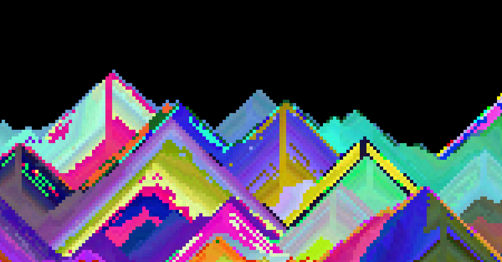

# Sandfall



# Dev Instructions
- install wat2wasm
  - `brew install wabt`
- install local server (optional)
  - `brew install http-server`
- install deno
  - `brew install deno`
- scripts
  - `build.sh` compiles wat to wasm and copies all src files to dist/
  - `serve.sh` serves app locally (optional)

## Algorithm
```
for each cell traversing rtl from bottom right to top left
  if cell empty:
    nop
  else if south_cell empty:
    set cell=empty
    set south_cell=cell
  else if west cell and south_west_cell empty:
    set cell=empty
    set south_west_cell=cell
  else if east and south_east_cell empty:
    set cell=empty
    set south_east_cell=cell
  else:
    nop
```
